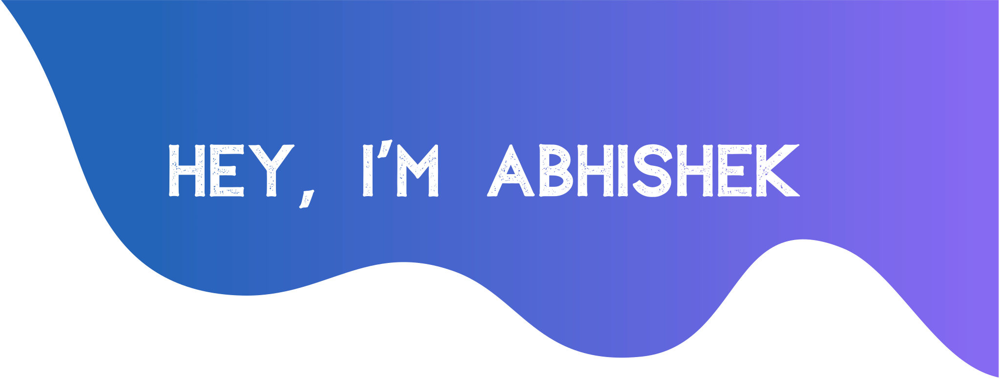

<!--  -->

# Hello World!, I'm commers, a Thailand Web Developer 👋🏼:
🛜 currently working on my own [webpage](https://www.tobiasmeyhoefer.de) 👨ğŸ¼â€ğŸ“ studying Computer engineering at chiangmai university 👨ğŸ¼â€ğŸ’» working as a codeapp ltd co. 2024  🬠just started out with my youtube channel <i>commers</i>

<!--  -->

  <!-- ฝั่งซ้าย: Tech Stack -->
  

    <h1>💻 Tech Stack:</h1>
    

      
      
      
      
      
      
      
      
      
      
      
      
      
      
      
      
      
      
      
      
      
      
      
      
      
      
      
      
      
      
      
      
    

  

  <!-- ฝั่งขวา: รูปภาพ -->
  

    
    
    
    
  

<picture>
  <source media="(prefers-color-scheme: dark)" srcset="https://raw.githubusercontent.com/tobiasmeyhoefer/tobiasmeyhoefer/output/github-snake-dark.svg" />
  <source media="(prefers-color-scheme: light)" srcset="https://raw.githubusercontent.com/tobiasmeyhoefer/tobiasmeyhoefer/output/github-snake.svg" />
  
</picture>

